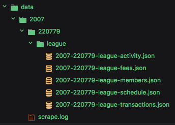

# 🏈 fantasy-espn-football
A page scraping utility for TLEOI

## What you'll find

### 🗂 `data`
Here you will find all the scraped data for the listed season(s) and league id(s). [[view data](./data)]

### 📈 `reports`
Here you will find a series of accumulated reports based upon the contents of the `data` directory

### 📁 `src`
This is all the nodejs code that was used to login and pull the data

## Getting started

### Requirements

*  [Node v8+](https://nodejs.org/en/)
*  [Yarn v0.27+](https://yarnpkg.com/en/)

### ⇢ `cp .env.example .env`
Copies example environment file to `./.env`. Fill out the values accordingly as they are **required** to run.

### 📦 `yarn install`
Installs dependencies needed to run

## Running the scraper

### 🚛 `yarn start`
Run the scraper for the configured league and season. Outputs the data into the `./data` accordingly.

### 📊 `yarn reporting`
Runs some reports on the scraped date. NOTE: You must run the data scraper piece before trying to crunch numbers.

## Development

### 🤓 `yarn dev`
Runs the scraper and watches the `src` directory for changes, then reruns.
